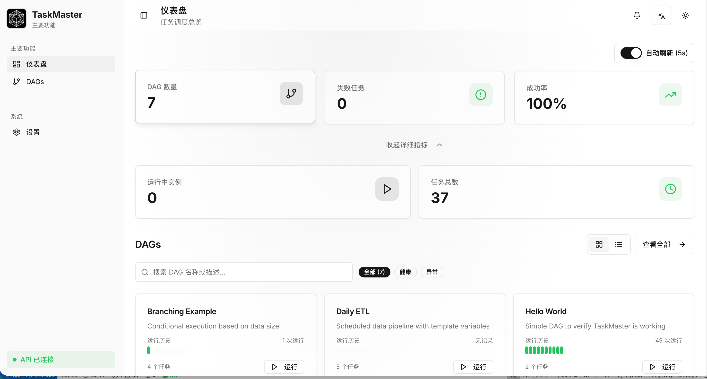

> [!NOTE]
> **DAGForge 正在积极开发中。**
> 我们正在构建一个基于现代 C++23 的高性能 DAG 工作流编排器，它的架构灵感来自 Apache Airflow，但专为高性能和低延迟执行进行了深度优化。

<div align="center">

# DAGForge

[](#)

</div>

> **告别 Python 带来的锁竞争和高延迟。**
> DAGForge 使用了受 Seastar 启发的独立分片异步运行时，每个 CPU 核心都有自己的 `io_context` (Boost.Asio) 和内存资源。
>
> 我们认为工作流编排不应该成为系统的瓶颈。DAGForge 提供了一个极速的 DAG 引擎，支持基于 TOML 的配置定义、异步持久化，并自带现代化的 React 19 Web 控制台。

<div align="center">

[](https://en.cppreference.com/w/cpp/23)
[](LICENSE)
[](https://deepwiki.com/CHAK-MING/DAGForge)

[English](README.md) | [简体中文](README_CN.md)

</div>

---

## ✨ 核心特性

- **分片运行时：** 基于 Boost.Asio 的核心独占 `io_context`，最大限度减少锁竞争。
- **DAG 引擎：** 基于 TOML 定义工作流，支持依赖图、触发规则、条件分支和传感器等待。
- **执行器：** 原生支持 Shell 命令、Docker 容器以及 Sensor 传感器模式。
- **XCom 机制：** 提供跨任务数据传递机制与模板变量支持（如 `{{ds}}`, `{{xcom_pull(...)}}`）。
- **Web UI：** 采用 React 19、Tailwind CSS 和 React Flow 构建的现代化可视化监控控制台。

## 📚 文档指南

### 新手入门
- **[快速开始指南](docs/USER_GUIDE.md#1-first-time-setup)** - 快速部署与运行。
- **[详细用户指南](docs/USER_GUIDE.md)** - 深度使用、模式与问题排查。
- **[配置指南](docs/USER_GUIDE.md#2-running-the-service)** - 运行时的配置与自定义。

### 核心功能
- **[触发规则](docs/USER_GUIDE.md#5-trigger-rules--when-to-use-each)** - 控制任务何时具备运行条件。
- **[XCom 示例](docs/USER_GUIDE.md#6-xcom--complete-examples)** - 通过 MySQL 跨任务共享数据。
- **[传感器任务](docs/USER_GUIDE.md#7-sensor-tasks)** - 阻塞并轮询外部条件。
- **[Docker 任务](docs/USER_GUIDE.md#8-docker-tasks)** - 在隔离的 Docker 容器中运行任务。
- **[分支 DAG](docs/USER_GUIDE.md#10-branching-dags)** - 流水线内的条件逻辑路径。

### 集成与部署
- **[API 参考](docs/API.md)** - HTTP REST 与 WebSocket API 接口。
- **[Docker 部署](docs/USER_GUIDE.md#8-docker-tasks)** - 简单的 `docker-compose` 编排。

### 问题排查
- **[故障排除指南](docs/USER_GUIDE.md#16-troubleshooting)** - 常见问题与解决方案。

---

## 🚀 快速开始（最小路径）

### 1) 下载 Release 压缩包（推荐）

```bash
# 从 GitHub Releases 下载（按需替换版本号）
curl -LO https://github.com/CHAK-MING/dagforge/releases/download/0.1.0-beta/dagforge-0.1.0-beta-linux-x86_64.tar.gz
tar -xzf dagforge-0.1.0-beta-linux-x86_64.tar.gz
cd dagforge-0.1.0-beta-linux-x86_64
```

二进制路径：`./bin/dagforge`

### 2) 准备 MySQL

```sql
-- 以 MySQL root 身份执行
CREATE DATABASE dagforge CHARACTER SET utf8mb4 COLLATE utf8mb4_unicode_ci;
CREATE USER 'dagforge'@'%' IDENTIFIED BY 'dagforge';
GRANT ALL PRIVILEGES ON dagforge.* TO 'dagforge'@'%';
FLUSH PRIVILEGES;
```

### 3) 配置

```bash
cp system_config.toml my_config.local.toml
export DAGFORGE_CONFIG=my_config.local.toml
```

### 4) 初始化数据库 + 校验 DAG

```bash
dagforge db init
dagforge validate
```

### 5) 启动服务（Release 包）

```bash
dagforge serve start

# 可选覆盖
dagforge serve start --log-level debug --shards 4
# 后台模式
dagforge serve start --daemon --log-file dagforge.log
```

API/UI：`http://127.0.0.1:8888`

### 6) 触发并查看

```bash
dagforge trigger hello_world --wait
dagforge inspect hello_world --latest
dagforge logs hello_world --latest
```

### 7) 备选方式：源码编译

```bash
cmake --preset default
cmake --build --preset default
./build/bin/dagforge serve start
```

### 8) 备选方式：Docker Compose

```bash
docker compose up -d
docker compose logs -f dagforge
```

---

## 💻 CLI 速查

```bash
# 服务
dagforge serve start  [-c file] [--daemon/-d] [--log-file path] [--no-api] [--log-level trace|debug|info|warn|error] [--shards N]
dagforge serve status [-c file] [--json]
dagforge serve stop   [-c file] [--timeout N] [--force]

# 触发与测试
dagforge trigger <dag_id> [--wait] [-e execution_date] [--no-api] [--json]
dagforge test <dag_id> <task_id> [--json]

# 列表
dagforge list dags  [--include-stale] [--limit N] [--json]
dagforge list runs  [dag_id] [--state failed|success|running] [--limit N] [--json]
dagforge list tasks [dag_id] [--json]

# 运行查看与日志
dagforge inspect <dag_id> [--run id|--latest] [--xcom] [--details] [--json]
dagforge logs <dag_id> [--run id|--latest] [--task task_id] [--attempt N] [-f|--follow] [--short-time] [--json]

# DAG 控制
dagforge pause <dag_id> [--json]
dagforge unpause <dag_id> [--json]
dagforge clear <dag_id> --run <run_id> [--task id|--failed|--all] [--downstream] [--json]

# 数据库
dagforge db init
dagforge db migrate
dagforge db prune-stale [--dry-run]

# 校验
dagforge validate [-c file | -f dag.toml] [--json]
```

---

## 🗺️ 官方路线图

查看 DAGForge 的未来规划：

1. **提升 API 安全：** 实现更完善的认证与授权机制。
2. **PostgreSQL 数据库支持：** 在 MySQL 的基础上增加对 PostgreSQL 的原生支持。
3. **更高效的一键配置：** 支持更流畅的自动化部署和一键起步流程。
4. **扩展执行器支持：** 提供更多的执行器，例如原生的 Kubernetes (k8s) 执行器，支持大规模横向扩展。
5. **可观测性增强：** 深度集成 OpenTelemetry 并提供更丰富的监控指标。
6. **性能深度优化：** 持续优化 C++23 协程运行时，进一步降低调度延迟。

---

## 🤝 贡献代码

我们欢迎任何形式的贡献！DAGForge 是一个完全开源（Apache 2.0）的项目，我们鼓励社区参与：

- 报告 bug 并提供功能建议。
- 改进文档。
- 提交代码优化和性能改进的 PR。
- 编写新的 Executor（执行器）和 Sensor（传感器）。

查看我们的 **[官方路线图](#-官方路线图)** 了解优先开发事项。

## 📎 资源链接

- **[发布日志 (Changelog)](CHANGELOG.md)** - 查看最近的重要更新。
- **[GitHub Issues](https://github.com/CHAK-MING/dagforge/issues)** - 报告错误或请求新功能。

## 📄 法律与协议

- **开源协议:** [Apache License 2.0](LICENSE)
