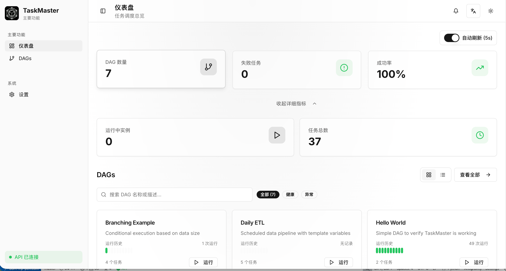

# DAGForge

<div align="center">

**基于现代 C++23 构建的高性能、低延迟 DAG 编排引擎**

[](https://en.cppreference.com/w/cpp/23)
[](LICENSE)
[](https://deepwiki.com/CHAK-MING/DAGForge)
[](https://github.com/CHAK-MING/dagforge/releases)

[English](README.md) | [简体中文](README_CN.md)

---

[](#)

</div>

---

## ⚡ 什么是 DAGForge？

**DAGForge** 是一个分片式、异步的工作流引擎，专为高吞吐、低延迟的任务调度而设计。受 **Seastar** 架构模型启发，并基于 **C++23 协程**构建，旨在最大限度地减少锁竞争，并充分发挥现代多核系统的性能。

无论是管理复杂的数据流水线、编排微服务，还是构建自动化的 CI/CD 工作流，DAGForge 都能为高频操作提供所需的性能和可靠性。

---

## ✨ 核心特性

- **🚀 分片运行时：** 基于 **Boost.Asio** 的 CPU 核心独占 `io_context`，最大限度减少跨核锁竞争。
- **🛠️ 基于 TOML 的工作流：** 简洁、声明式的 DAG 定义，支持依赖关系、触发规则和传感器。
- **🔌 多执行器支持：** 原生支持 **Shell** 命令、**Docker** 容器以及 **Sensor**（轮询）执行模式。
- **📡 实时可视化：** 采用 **React 19** 和 **React Flow** 构建的现代化控制台，支持 **WebSocket** 实时日志流。
- **🔄 智能数据共享：** 通过 MySQL/MariaDB 实现的 **XCom** 机制，支持模板变量（如 `{{xcom.task.key}}`）。
- **📊 可观测性：** 内置 **Prometheus** 指标、HTTP REST API 和结构化 JSON 日志，实现无缝集成。

---

## 📈 性能快照

DAGForge 为速度而生。在最新一轮按 NUMA node 0 绑定的 5 轮基准测试中，它把 p95 调度尾延迟压在个位数毫秒级，同时在 burst-ready 负载下维持约 7,200 tasks/s 的吞吐。

| 测试场景 | 拓扑结构 | 总任务数 | 平均总 Lag | p95 Lag | 吞吐量 | 对比 Airflow 2.0 |
| --- | --- | ---: | ---: | ---: | ---: | ---: |
| `scene1_linear` | 100 DAGs × 10 线性任务 | 1,000 | 0.660 s | 5.40 ms | **4,872 tasks/s** | **约快 17.6 倍** |
| `scene2_linear` | 10 DAGs × 100 线性任务 | 1,000 | 0.231 s | 1.00 ms | **6,933 tasks/s** | **约快 62.0 倍** |
| `scene6_burst` | 1 DAG × 1,001 爆发任务 | 1,001 | 1.608 s | 1.60 ms | **7,215 tasks/s** | **N/A** |

> 完整的基准测试报告请看 [基准测试报告 (Benchmark Report)](docs/BENCH_REPORT.md)。

> [!TIP]
> **查看 [基准测试报告 (Benchmark Report)](docs/BENCH_REPORT.md)** 了解详细分析以及与其他引擎的对比。

---

## 🚀 快速开始

### 1) 环境准备
- **Linux** (x86-64 或 ARM64)
- **MySQL 8.0+** 或 **MariaDB 11+**
- **build2 0.17+** (源码编译必选)

### 2) 下载并运行
使用 **[Release 压缩包](https://github.com/CHAK-MING/dagforge/releases)** 是最快的上手方式。

```bash
# 1. 下载并解压
curl -LO https://github.com/CHAK-MING/dagforge/releases/download/0.3.0/dagforge-0.3.0-linux-x86_64.tar.gz
tar -xzf dagforge-0.3.0-linux-x86_64.tar.gz && cd dagforge-0.3.0

# 2. 初始化数据库 (确保 MySQL 已启动)
./bin/dagforge db init

# 3. 启动服务
./bin/dagforge serve start --shards 4
```

访问 **[http://localhost:8888](http://localhost:8888)** 即可查看 Web 控制台。

### 3) 备选方案：源码编译 (build2)
```bash
# 初始化构建配置
bdep init -C build @gcc cc config.cxx=g++
# 更新并构建
bdep update @gcc
# 启动服务
./bin/dagforge serve start -c system_config.toml
```

### 4) 备选方案：Docker Compose
```bash
docker compose up -d
```

---

## 📚 文档指南

详细指南和参考文档可在 **[`docs/`](docs/)** 目录中找到：

- **[新手入门指南](docs/USER_GUIDE.md#1-first-time-setup)** - 逐步安装与配置。
- **[核心功能指南](docs/USER_GUIDE.md#5-trigger-rules--when-to-use-each)** - 触发规则、XCom、传感器与 Docker 任务。
- **[API 参考](docs/API.md)** - 探索 REST 和 WebSocket 接口。
- **[CLI 速查表](docs/USER_GUIDE.md#16-cli-cheatsheet)** - 掌握 `dagforge` 命令行工具。

---

## 🗺️ 路线图

- [x] **OpenTelemetry：** 深度追踪和可观测性集成。
- [ ] **API 安全性：** 实现基于角色的访问控制 (RBAC) 和身份认证。
- [ ] **PostgreSQL 支持：** 增加对 Postgres 作为存储后端的支持。
- [ ] **Kubernetes 执行器：** 在 K8s 集群中实现可扩展的任务执行。
- [ ] **协程优化：** 进一步降低 C++23 运行时的调度延迟。

---

## 🤝 贡献代码

我们欢迎任何形式的贡献！无论是 Bug 报告、功能建议还是文档改进，我们都非常重视。

1. Fork 本仓库。
2. 创建您的特性分支 (`git checkout -b feature/amazing-feature`)。
3. 提交您的更改 (`git commit -m 'Add amazing feature'`)。
4. 推送到分支 (`git push origin feature/amazing-feature`)。
5. 开启一个 Pull Request。

查看我们的 **[官方路线图](#-路线图)** 了解高优先级事项。

---

## 📄 开源协议

基于 **Apache License 2.0** 协议发布。详情请参阅 `LICENSE` 文件。

---

<div align="center">
  DAGForge 团队倾情打造 ❤️
</div>
